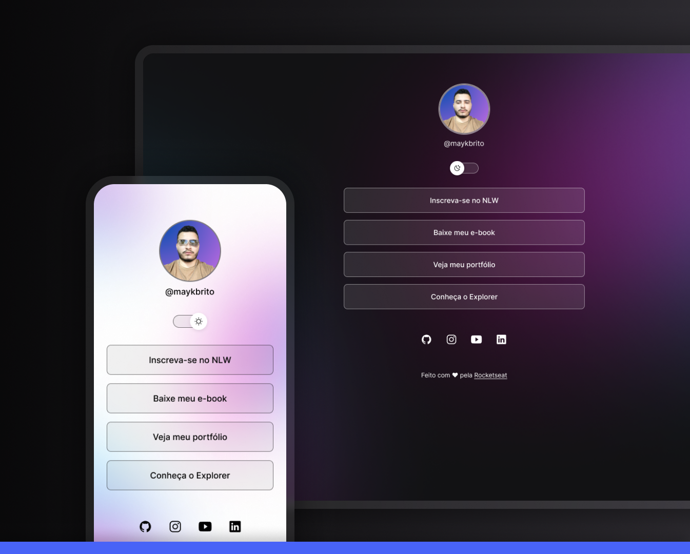

<h1 align="center"> Cartão de Apresentação </h1>

Cartão de apresentação onde disponibiliza acesso fácil aos principais links de perfis e fazer contato

  <a href="#-tecnologias">Tecnologias</a>&nbsp;&nbsp;&nbsp;|&nbsp;&nbsp;&nbsp;
  <a href="#-projeto">Projeto</a>&nbsp;&nbsp;&nbsp;|&nbsp;&nbsp;&nbsp;
  <a href="#-layout">Layout</a>&nbsp;&nbsp;&nbsp;|&nbsp;&nbsp;&nbsp;
  <a href="#memo-licença">Licença</a>

 

  

## 🚀 Tecnologias

Esse projeto foi desenvolvido com as seguintes tecnologias:

- HTML e CSS
- JavaScript
- Git e Github

## 💻 Projeto

O cartão de apresentação facilita aos recrutadores e amigos a acessar perfis inportantes e fazer contato.

## 🔖 Layout

Você pode visualizar o layout do projeto através [DESSE LINK](https://www.figma.com/file/EwrJEDo3Tn3FESNgJ5BFPl/Cart%C3%A3o-Apresenta%C3%A7%C3%A3o?type=design&node-id=10%3A620&t=qZA1NjPbzpxPspyb-1). É necessário ter conta no [Figma](https://figma.com) para acessá-lo.

---

Feito com ♥ by Tiago Santos